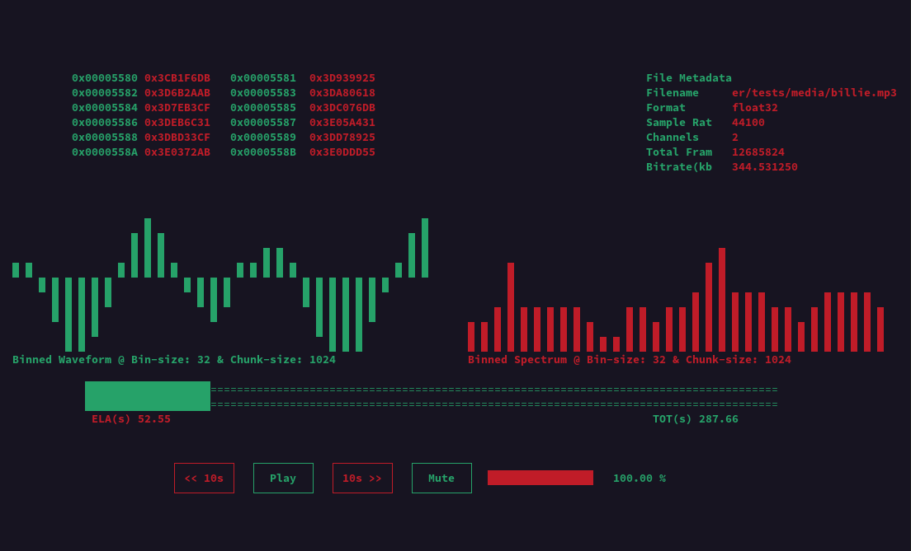

# cursedAudioPlayer

*terminal audio player for the modern console hacker.*

---

## Description

A no-bs, ncurses-driven audio player built in C++20.  
Visualizes raw audio data and spectrum live in hex and graphs.

No GUI. No distractions. Just pure terminal vibes — like a proper hacker’s tool.

---

## Build & Run

```bash
git clone https://github.com/yourname/cursedAudioPlayer.git
cd cursedAudioPlayer
mkdir build && cd build
cmake ..
make -j
./cap path/to/audio.wav
```

## Dependencies
- C++20 compiler
- cmake ≥ 3.22
- ncurses
- miniaudio

## Install (optional)
```bash
sudo make install
```
(or set `CMAKE_INSTALL_PREFIX` for local install)

## Snapshot


## Contribution
PRs and issues are welcome.
- Follow C++20 standards (RAII, smart pointers)
- Use meaningful commit messages.
- Update changes in documents.
- Keep code modular and readable.

## LICENSE
GNU License. See `LICENSE` for full terms. 