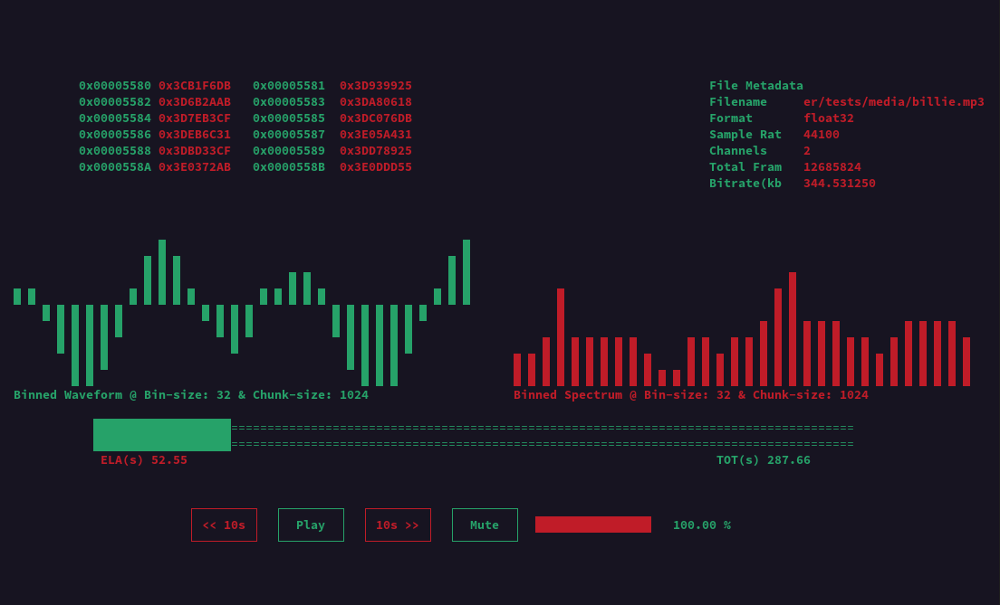

# cursedAudioPlayer

*terminal audio player for the modern console hacker.*

A C++20, ncurses-driven audio player with live waveform, FFT spectrum, CQT pitch classes, and
float32 hex telemetry. The green/red console theme stays deliberately hacky.

## Build & run

Dependencies: C++20 compiler, CMake ≥ 3.22, ncurses development headers.
Miniaudio and [ECQT](https://github.com/havoksahil/ecqt) with its pinned PFFFT
dependency are bundled in `external/`; builds work offline.

```bash
cmake -S . -B build -DCMAKE_BUILD_TYPE=Release
cmake --build build -j
./build/cursedap path/to/audio.wav
```

WAV, MP3, and FLAC are supported by the bundled decoder. The optional second
argument selects the processing and FFT chunk size (default 1024), a power of
two between 64 and 1048576:

```bash
./build/cursedap path/to/audio.mp3 1024
```

Playback starts paused. Use a terminal at least 80 columns × 24 rows.

## Controls

| Key | Action |
|---|---|
| Space | Play / pause; replay after the track finishes |
| b / Left | Seek backward 10 seconds |
| f / Right | Seek forward 10 seconds |
| + / = / Up | Raise volume by 5% |
| - / Down | Lower volume by 5% |
| m | Mute / unmute |
| Home / End | Seek to start / end |
| q / Esc | Quit |

Click buttons, the playback bar, or the volume bar to control the player.
Click a text field and use `[` / `]` to scroll clipped text.
Rendering batches all windows into one screen update at approximately 60 fps.
Terminal resizing relays out the widgets; smaller terminals show a resize hint.

Waveform, FFT spectrum, and CQT pitch classes are visible simultaneously.
The FFT uses a Hann window and shows normalized magnitudes in dBFS. ECQT uses
12 bins per octave starting at A1 (55 Hz), with a rolling full-length window
that preserves low-note resolution independently of playback chunk size.
Octave energies are folded into C, C#, D, D#, E, F, F#, G, G#, A, A#, and B;
the strongest pitch class is 0 dB relative, with a silence gate below -80 dBFS.
All analysis views use channel 0. Hex telemetry shows averaged float32 PCM bin
bit patterns, rather than encoded file bytes; the metadata rate is PCM kbps.

## Tests

```bash
ctest --test-dir build --output-on-failure
```

Default tests cover decoding, seeking, ring-buffer wrapping and padding,
independent visualization queues, FFT frequency bins and inverse transforms,
subscriptions, and CQT pitch/amplitude, rolling-window, and silence checks.
Checks remain enabled in Release builds.

For playback integration tests with an available output device:

```bash
cmake -S . -B build -DTEST_AUDIO_DEVICE=ON
cmake --build build -j
ctest --test-dir build --output-on-failure
```

To test playback silently without audio hardware, build a separate directory
with miniaudio's null backend:

```bash
cmake -S . -B build-null -DTEST_AUDIO_DEVICE=ON \
  -DCMAKE_CXX_FLAGS="-DMA_ENABLE_ONLY_SPECIFIC_BACKENDS -DMA_ENABLE_NULL"
cmake --build build-null -j
ctest --test-dir build-null --output-on-failure
```

## Linux packages

The executable is `cursedap`. Download the package matching your distro from
[GitHub Releases](https://github.com/havoksahil/cursedAudioPlayer/releases).
See [Linux release and AUR instructions](packaging/README.md) for installation,
release automation, and submitting the AUR recipe when an account is available.

## Install & documentation

```bash
cmake --install build --prefix "$HOME/.local"
```

Enable API documentation with `-DMAKE_DOCS=ON` when Doxygen is installed.

## Snapshot



## Contribution

- Follow C++20 standards, RAII, and smart-pointer ownership.
- Keep the audio, analysis, and widget modules separate and readable.
- Use meaningful commit messages and update documentation alongside changes.

## License

GNU General Public License. See [LICENSE](LICENSE).
